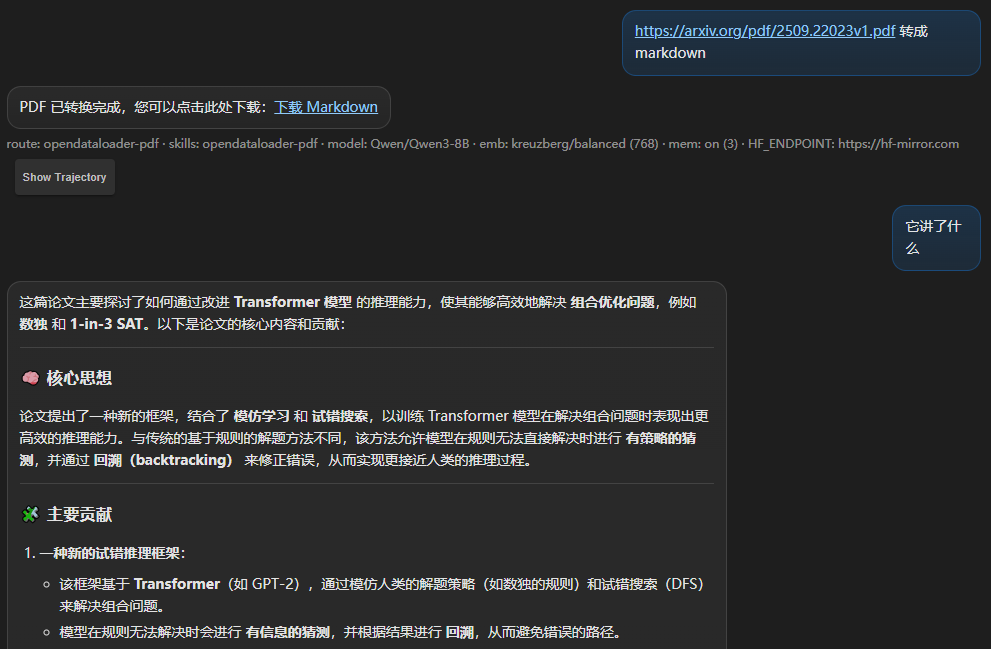

# skill-router



这个项目是一个“Skill 路由 + 执行”服务：从仓库的 `agent/skills/` 目录读取可用 skills（`CATALOG.md` + 各 `*/SKILL.md`），通过 OpenAI 兼容接口完成两件事：

- 路由：根据用户输入选择最合适的 skill
- 执行：把 skill 内容注入上下文后调用模型产出结果（可选上传文档作为额外上下文）

这个目录把仓库里的 `skill_router`（Python CLI）改成 Node.js 的 TypeScript HTTP 服务，并自带一个最小网页 UI（`public/`）方便本地调用与调试。

- `GET /skills`：列出可用 skills
- `POST /choose`：仅做路由选择
- `POST /run`：路由选择 + 注入 skill 内容后调用模型（可选：上传/抓取文档作为任务上下文；支持 SSE 流式进度）
- `POST /documents/extract`：上传文档/URL 并使用 `@kreuzberg/node` 在本机提取文本（图片可选 OCR）
- `GET /outputs/*`：下载 `./output/` 目录下生成的文件（例如文档提取/转换的全文）
- `GET|POST|DELETE /memories`：查看/新增/删除用户记忆（默认仅允许 `/user/*`）
- `GET /embeddings/status` + `POST /embeddings/download`：查看/预下载 Kreuzberg embedding 预设模型（用于检索/记忆）
- `GET /ocr/status` + `POST /ocr/download`：查看/下载 guten-ocr（用于图片 OCR）

skills 来源直接读取仓库里的 `agent/skills/` 目录（包含 `CATALOG.md` 和各个 `*/SKILL.md`）。

## 配置与传参

服务调用 OpenAI 兼容端点需要 3 个配置（每个请求都会用到）：

- 方式 A：在服务器进程环境变量里设置
  - `OPENAI_API_KEY`
  - `OPENAI_BASE_URL`（例如 `https://api.openai.com/v1` 或你的兼容端点）
  - `OPENAI_MODEL`（例如 `gpt-4.1-mini`）
- 方式 B：由网页在浏览器本地保存（localStorage），并通过请求头传入（同一浏览器下关闭/重新打开仍保留，可手动清空）
  - `X-OpenAI-API-Key`
  - `X-OpenAI-Base-URL`
  - `X-OpenAI-Model`

此外还支持“可选增强”：

- Embedding 模型（用于检索/记忆）：
  - 环境变量：`EMBEDDING_MODEL` / `OPENAI_EMBEDDING_MODEL`
  - 请求头：`X-OpenAI-Embedding-Model`
  - 说明：支持 OpenAI 兼容 embedding 模型名，也支持 Kreuzberg 的 `preset:*`（例如 `preset:fast`）
- 透传上游请求头（例如组织 ID、自建网关 Header）：
  - 环境变量：`OPENAI_DEFAULT_HEADERS`（JSON 字符串，例如 `{"OpenAI-Organization":"..."}`）
  - 请求头：`X-OpenAI-Default-Headers`（JSON 字符串）
  - 另外：所有非浏览器/代理相关的自定义请求头（且不以 `x-openai-` 开头）也会被透传
- 额外 System Message：
  - 环境变量：`OPENAI_SYSTEM_CONTENT`
  - 请求头：`X-OpenAI-System-Content`
  - 请求体字段：`systemContent`（`/choose` 与 `/run` 均支持，优先级最高）
- Hugging Face 镜像/端点（用于 embedding/OCR 自动下载）：
  - 环境变量：`HF_ENDPOINT`（仅接受 `https://huggingface.co` 或 `https://hf-mirror.com`）
  - 请求头：`X-HF-Endpoint`

## 本地运行

在本目录下：

```bash
npm i
npm run dev
```

浏览器打开启动日志里输出的地址（默认 `http://127.0.0.1:8080/`；如果端口被占用会自动顺延），即可在页面里配置并调用接口。

<br />

## 调用示例

```bash
curl -s http://127.0.0.1:8080/skills | head
```

```bash
curl -s http://127.0.0.1:8080/choose ^
  -H "content-type: application/json" ^
  -d "{\"query\":\"帮我设计一个 REST API 的分页规范\",\"systemContent\":\"你只输出 JSON\"}"
```

```bash
curl -s http://127.0.0.1:8080/run ^
  -H "content-type: application/json" ^
  -d "{\"query\":\"帮我设计一个 REST API 的分页规范\",\"systemContent\":\"请用中文回答\"}"
```

```bash
curl -s http://127.0.0.1:8080/run ^
  -F "query=请根据文档内容，提炼关键结论并给出执行建议" ^
  -F "systemContent=请用要点列表输出" ^
  -F "file=@./path/to/document.pdf"
```

```bash
curl -s http://127.0.0.1:8080/documents/extract ^
  -F "file=@./path/to/document.pdf"
```

说明：

- `mime_type`/`mimeType` 字段可选；后端会优先按上传文件自带的 Content-Type、文件内容特征（magic bytes）与文件扩展名自动识别。
- 如果你需要强制指定解析类型（例如把无扩展名文件当作 PDF），再手动传 `mime_type=application/pdf`。

<br />

## /run 请求体要点

`POST /run` 支持两种请求体：

- `application/json`：适合纯文本任务，或让服务自动从用户输入里提取文档 URL 并抓取（可关闭）
- `multipart/form-data`：显式上传文件/传 URL，适合“必须使用这份文档”的场景

常用字段（JSON 与表单字段同名）：

- `query`：用户问题（与 `messages` 二选一，至少提供一个）
- `messages`：对话数组 `[{role:"user"|"assistant", content:"..."}]`
- `summary`：可选，已有对话摘要（用于继续对话）
- `systemContent`：可选，额外 system message
- 文档输入（二选一）：
  - 显式 URL：`document_url` / `document_urls`（也兼容 `documentUrl` / `documentUrls`）
  - 自动抓取：默认会从最后一条用户输入里识别候选文档链接并抓取（可用 `auto_document_url: false` 关闭）
- 记忆检索开关：`memory` / `use_memory` / `memory_enabled`（默认开启）

流式（SSE）：

- 在请求头加 `Accept: text/event-stream`，或 URL 加 `?stream=1`
- 事件：
  - `stage`：阶段进度（例如解析/下载/提取/检索/路由/生成）
  - `result`：最终 JSON 结果
  - `error`：错误信息
  - `done`：流结束

<br />

## 文档提取与 OCR

- `POST /documents/extract`：仅做提取（不调用模型），支持：
  - `multipart/form-data`：`file`/`document` 或 `url`/`document_url`
  - `application/json`：`data_base64` 或 `url`
- 图片 OCR 相关参数（两端点都支持）：
  - `ocr_backend`：`tesseract`（默认）或 `guten-ocr`
  - `ocr_language`：如 `eng`
  - `ocr_auto_download`：`1/true` 自动下载 guten-ocr（当未安装 tesseract 或明确指定 guten-ocr 时）
  - `hf_endpoint` / `X-HF-Endpoint`：下载加速（仅接受 `https://huggingface.co` / `https://hf-mirror.com`）

<br />

## 输出文件下载

- 服务会把部分“长文本结果”（例如文档提取/转换全文）写入 `./output/` 并返回下载地址
- 通过 `GET /outputs` 可列出部分目录项，通过 `GET /outputs/<relative-path>` 下载文件（以附件方式返回）

<br />

## 记忆与上下文管理

服务内置一个简单的“记忆/上下文检索”机制，用于在 `/run` 时为模型补充相关历史与资料：

- `GET /memories?path=/user&tree=true`：获取 `/user` 分支树
- `GET /memories?path=/user/...`：列出某个路径下的节点
- `POST /memories`：新增记忆（仅允许写入 `/user/*`）
- `DELETE /memories`：删除记忆（仅允许删除 `/user/*`）

实现细节可直接查看 `src/context/` 目录下的实现。

<br />

## 构建与脚本

```bash
npm run build
npm run start
```

常用脚本：

- `npm run dev`：开发模式（含前端 vendor 构建 + TS watch）
- `npm run smoke`：基础冒烟（见 `scripts/`）
- `npm run build:vendor`：仅重建网页依赖的 vendor 文件
